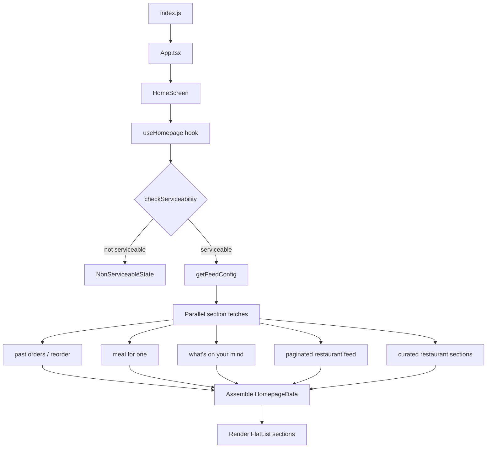

# Owanly — Homepage Assignment

A React Native app that implements a food-delivery style homepage. Data is loaded through a mock API layer backed by local JSON fixtures, structured so a real backend can be swapped in later without changing screen or hook code.

## Overview

The app is organized by **layer**, not by feature folders. Each layer has a single responsibility:

| Layer | Path | Role |
|-------|------|------|
| **Entry** | `index.js`, `App.tsx` | Bootstraps React Native, wraps the app in `SafeAreaProvider`, renders `HomeScreen` |
| **Screens** | `src/screens/` | Full-page views. Currently only `HomeScreen` |
| **Hooks** | `src/hooks/` | Data orchestration — `useHomepage.ts` owns loading state and assembles feed data |
| **Data** | `src/data/` | Mock API (`homepageApi.ts`) + `fixtures.json` stand in for backend endpoints |
| **Types** | `src/types/` | TypeScript models for API responses and shared contracts |
| **Components** | `src/components/common/` | Reusable UI (loading, empty, error, veg indicator, etc.) |
| | `src/components/homepage/` | Homepage-specific sections and cards |
| **Constants** | `src/constants/` | Theme tokens (`theme.ts`) and asset paths (`assets.ts`) |
| **Assets** | `assets/icons/` | Static images used in the UI |
| **Native** | `android/`, `ios/` | Platform-specific React Native projects |

`HomeScreen` is the only screen. It calls `useHomepage()`, which fetches everything the feed needs, then maps each block of data to a section component inside a vertical `Animated.FlatList`.

## Folder structure

```
owanly/
├── App.tsx                 # Root component — wraps HomeScreen in SafeAreaProvider
├── index.js                # Registers the app with React Native
├── app.json                # App display name
│
├── src/
│   ├── screens/            # Full-screen views
│   │   └── HomeScreen/     # Main homepage (scrollable feed + sticky headers)
│   │
│   ├── hooks/              # Data-fetching and state logic
│   │   └── useHomepage.ts  # Orchestrates serviceability → feed config → sections
│   │
│   ├── data/               # API / fixture layer
│   │   ├── homepageApi.ts  # Async functions mirroring real backend endpoints
│   │   └── fixtures.json   # Local mock responses (no network calls)
│   │
│   ├── types/              # TypeScript models
│   │   └── homepage.ts     # Feed config, restaurants, food items, etc.
│   │
│   ├── components/
│   │   ├── common/         # Reusable UI (LoadingState, EmptyState, VegIndicator, …)
│   │   └── homepage/       # Section components (ReorderSection, MealForOneSection,
│   │                         # RestaurantListing, …) and shared cards (FoodCard, …)
│   │
│   └── constants/          # Design tokens and asset paths
│       ├── theme.ts        # Colors, spacing, typography
│       └── assets.ts       # Icon/image references
│
├── assets/icons/           # Static images used in the UI
├── android/                # Android native project
├── ios/                    # iOS native project
└── __tests__/              # Jest tests
```

## App flow

End-to-end, data moves through the app like this:

```
index.js → App.tsx → HomeScreen → useHomepage()
                                        ↓
                              checkServiceability()
                                        ↓
                         not serviceable? → NonServiceableState
                                        ↓
                              getFeedConfig()
                                        ↓
                    Promise.all (parallel section fetches)
                                        ↓
                              HomepageData assembled
                                        ↓
                    HomeScreen renders Animated.FlatList sections
```



### 1. Entry point

`index.js` registers `App.tsx` with React Native. `App.tsx` sets up `SafeAreaProvider` and renders `HomeScreen`.

### 2. Data loading (`useHomepage`)

The hook in `src/hooks/useHomepage.ts` drives the homepage in three steps:

1. **Check serviceability** — `checkServiceability()`  
   If the location is not serviceable, the screen shows `NonServiceableState`.

2. **Load feed config** — `getFeedConfig()`  
   Returns layout metadata: banner, reorder block, curated section ids, meal-for-one config, etc.

3. **Fan out to section endpoints** — all called in parallel via `Promise.all`:
   - `getPastOrders()` → reorder carousel
   - `getMealForOneItems()` → meal-for-one horizontal list
   - `getCuratedListDetails()` → “What’s on your mind?” categories
   - `getPaginatedRestaurantFeed()` → main restaurant listing
   - `getCuratedRestaurants(id)` → one call per curated section id from feed config

The hook exposes `status` (`loading` | `non-serviceable` | `error` | `ready`), `data`, and `reload`.

### 3. Mock API layer (`homepageApi.ts`)

`src/data/homepageApi.ts` reads from `fixtures.json` and returns delayed promises (~350 ms) to simulate network latency. Function names and shapes match the real endpoints documented in the assignment, so replacing fixtures with HTTP calls is a drop-in change — screens and hooks stay untouched.

| Function | Real endpoint (conceptual) | Fixture key |
|----------|--------------------------|-------------|
| `checkServiceability()` | `POST /serviceability/check` | `serviceability` |
| `getFeedConfig()` | `GET /feed-configs/current-feed-config` | `feed_config` |
| `getMealForOneItems()` | `POST /getFeedForCuratedList` (food) | `curated_feed_Food_item` |
| `getCuratedRestaurants(id)` | `POST /getFeedForCuratedList` (restaurants) | `curated_feed_res_item` |
| `getCuratedListDetails()` | `POST /getCuratedListDetails` | `curated_list_details` |
| `getPastOrders()` | `POST /get-feed-for-user-past-orders` | `past_orders` |
| `getPaginatedRestaurantFeed()` | `POST /getPaginatedRestaurantFeed` | `paginated_restaurant_feed` |

### 4. Rendering (`HomeScreen`)

`HomeScreen` builds an ordered list of sections from `HomepageData` and renders them in an `Animated.FlatList`. While loading, it shows `LoadingState`; on error, `EmptyState` with a retry via `reload`.

| Order | Section type | Component | Data field (`HomepageData`) |
|-------|--------------|-----------|-----------------------------|
| 1 | Top banner | `HomeTopSection` | `topBannerImage` |
| 2 | Reorder | `ReorderSection` | `reorder` |
| 3 | What’s on your mind | `WhatsOnYourMind` | `whatsOnYourMind` |
| 4 | Meal for one | `MealForOneSection` | `mealForOne` |
| 5+ | Curated restaurants | `RestaurantCuratedSection` | `curatedSections[]` (one row per section) |
| Last | Restaurant listing | `RestaurantListing` | `restaurants` |

**Sticky headers:** When the user scrolls past “What’s on your mind?” or the filter bar inside the restaurant listing, pinned copies appear at the top of the screen. This is handled with `react-native-reanimated` scroll measurement and viewability callbacks. The whole screen is wrapped in `ErrorBoundary`, which calls `reload` on reset.

### 5. Shared pieces

- **`src/types/homepage.ts`** — TypeScript interfaces for API responses and component props (`FeedConfig`, `RestaurantEntity`, `FoodItem`, etc.).
- **`src/constants/theme.ts`** — Colors, spacing, and typography tokens used across components.
- **`src/constants/assets.ts`** — Centralized icon and image references.
- **`src/components/common/`** — `LoadingState`, `EmptyState`, `NonServiceableState`, `ErrorBoundary`, `VegIndicator`, `RatingBadge`, `SectionHeader`, and other small reusable widgets.

## Getting started

### Prerequisites

Complete the [React Native environment setup](https://reactnative.dev/docs/set-up-your-environment) guide.

### Run the app

```sh
# Start Metro
npm start

# Android (new terminal)
npm run android

# iOS (first time or after native dep changes)
bundle install
bundle exec pod install
npm run ios
```

### Other scripts

```sh
npm test    # Run Jest tests
npm run lint
```

## Tech stack

- React Native 0.86
- TypeScript
- react-native-reanimated (scroll animations, sticky headers)
- react-native-safe-area-context
- react-native-linear-gradient
